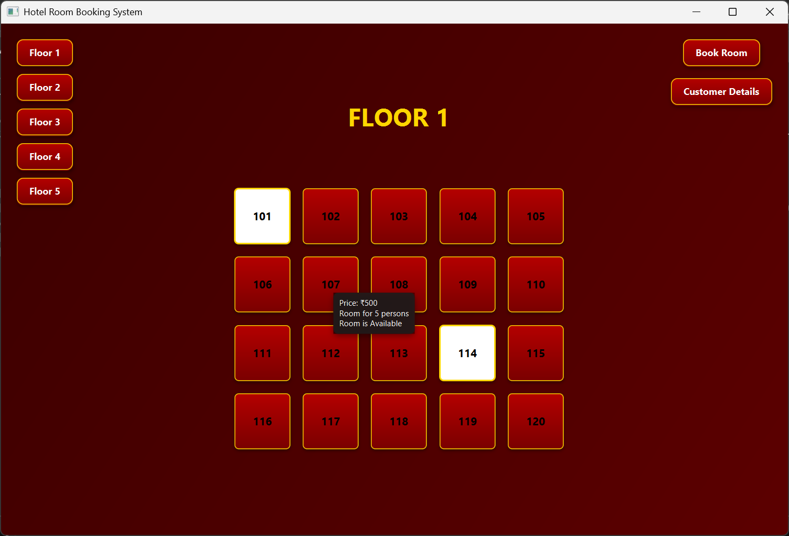
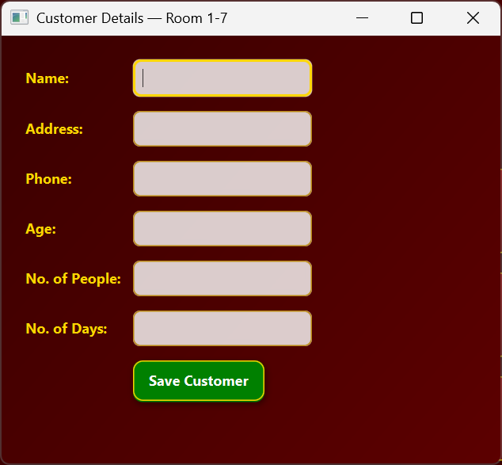
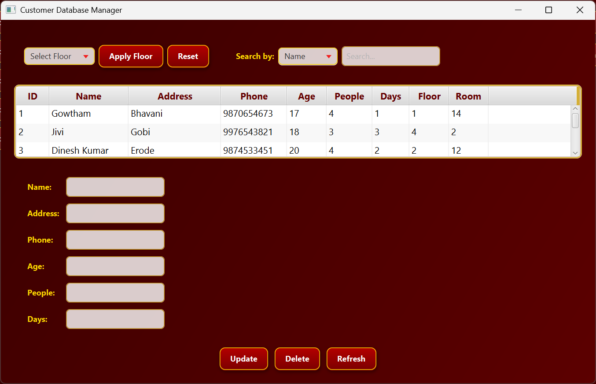

# 🏢 Hotel Room Booking Management System (JavaFX)

A desktop-based **Hotel / Hostel Room Booking Management System** built using **JavaFX** and **PostgreSQL**.  
This application allows managing room availability, booking rooms, storing customer details and administering bookings through the JavaFX UI.

## 🧩 Project Overview
 
This project is designed mainly for **students and beginners** to understand how JavaFX interfaces interact with a relational database.

The system helps manage:
- Room availability
- Customer details
- Room booking and allocation

It provides a simple and user-friendly interface to perform booking operations efficiently while storing all data securely in a PostgreSQL database.

## 🛠️ Features

- 🏨 Manage hotel rooms with floor and room numbers  
- 👤 Store and manage customer details  
- 📅 Book rooms based on availability
- 🟥⬜ Different room color based on the room availability 
- 🧾 Maintain customer stay information (days, people, age, etc.)
- 🖱️ While hover on the grid it shows the room details (Price, Capacity, Availability)
- 💾 PostgreSQL database integration using JDBC  
- 🖥️ Interactive and user-friendly JavaFX interface  
- 🔄 Easy to modify for other databases (MySQL / Oracle) with minor code changes  

## 📜 (Requirements/Steps To Follow) For The Project
- Install **JDK 17 or above** After installation, verify using:
  ```bash
   java -version
   javac -version
- Download the Javafx-sdk-25 from the given link and rename it to **"javafx-sdk-25"**
- Download postgreSQL jar from the provided link and store in a folder name **"PostgreSQL"**
- Download the required Jar file for your database to connect Java code and the database
- ⚠️ Follow the project structure as given 
- ⚠️ You can use any database for this project. **"But you need to alter the code"**
- 🎯 Create a database and set a password in your database
- 🎯 Open the Java source code and update the Username and database password were I mentioned
- 📌It is important to create this table in your database before running the code
- Use the compile and run command to run the application

## 📁 Project Structure

    Hotel-Room-Booking-Management-JAVA-FX/
    │
    ├── Code/ 
    │ ├── MainView.java
    │ ├── CustomerDetailsWindow.java
    │ ├── CustomerManagementWindow.java
    │ ├── Customer.java
    │ └── RoomInfo.java
    │
    ├── Compiled/
    │    └──manager-style.css
    │    └── # Compiled .class files
    │
    ├── PostgreSQL/
    │ └── postgresql-42.7.3.jar
    │
    ├── javafx-sdk-25/
        └── lib/

## 🔗 Files To Download
- Javafx-SDK file Download link -> https://download2.gluonhq.com/openjfx/25.0.2/openjfx-25.0.2_windows-x64_bin-sdk.zip
- PostgreSQL Jar file Download link -> https://jdbc.postgresql.org/download/postgresql-42.7.3.jar

## ▶️ How To Compile and Run
- This command is to Compile the files in the code folder and store it in the compiled folder and run it.
  
        javac --module-path javafx-sdk-25\lib --add-modules javafx.controls,javafx.fxml \-cp PostgreSQL\postgresql-42.7.3.jar -d Compiled Code\*.java && \java --module-path javafx-sdk-25\lib --add-modules javafx.controls,javafx.fxml \-cp "Compiled;PostgreSQL\postgresql-42.7.3.jar" MainView

## 💾 Command To Create Tables
- To create the table Customer to store the Customer details
  
        CREATE TABLE rooms (
        id SERIAL PRIMARY KEY,
        floor_no INT NOT NULL,
        room_no INT NOT NULL,
        price INT NOT NULL,
        capacity INT NOT NULL
        );
- To create the table Customer to store the Customer details

        CREATE TABLE customers (
        id SERIAL PRIMARY KEY,
        name VARCHAR(100),
        address TEXT,
        phone VARCHAR(15),
        age INT,
        people INT,
        days INT,
        floor_no INT,
        room_no INT
      );


## 📸 Application Screenshots

### 🏠 Main Dashboard
<p align="center">
  
</p>

### 👤 Customer Booking Window
<p align="center">
  
</p>

### 🛢️ Customer Database Details
<p align="center">
  
</p>

